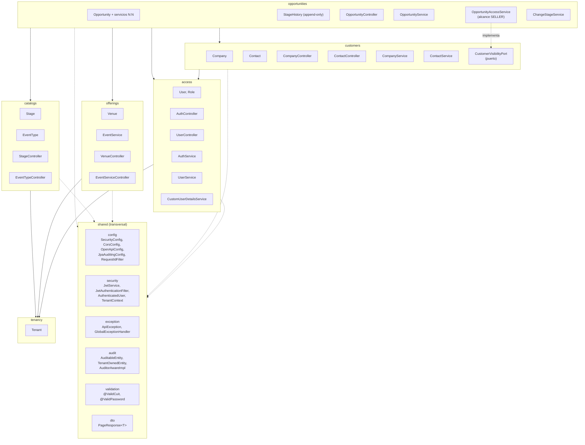

# Diagrama de componentes

Snapshot del corte de **estabilización post-E1** (13/09). Refleja los módulos y capas
implementados; todavía no incluye `activities` ni el ABM administrativo de offerings y
catálogos.

## Reglas de dependencia (ADR-001)

- Las flechas llenas van del módulo consumidor al `service` público del módulo
  consumido — nunca a su `repository` ni a su `domain`. Por ejemplo,
  `OpportunityService` llama a `CompanyService.getSummary(id)`, nunca a
  `CompanyRepository`.
- Todo FK de `Opportunity` hacia otro módulo (`companyId`, `contactId`, `salesRepId`,
  `venueId`, `stageId`, `originId`) es un `Long` plano, no un `@ManyToOne` — evita el
  acoplamiento de entidades JPA entre módulos.
- Dentro de un mismo módulo sí hay relaciones JPA normales: `Contact.company` es un
  `@ManyToOne` real porque `Contact` y `Company` viven los dos en `customers`.
- Las flechas punteadas hacia `shared` son de uso transversal (seguridad, auditoría,
  errores), no relaciones de negocio.
- La flecha punteada `OpportunityAccessService → CustomerVisibilityPort` representa
  inversión de dependencias: el puerto pertenece a `customers`, mientras
  `opportunities` resuelve las relaciones usando exclusivamente su propio repositorio.
