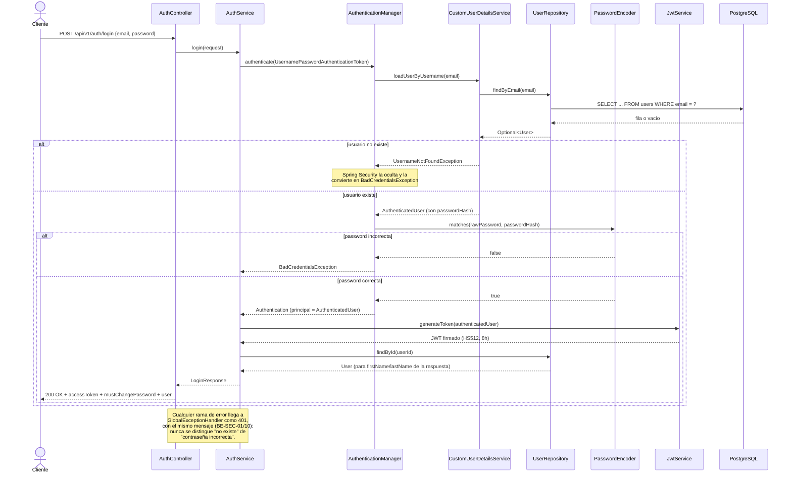
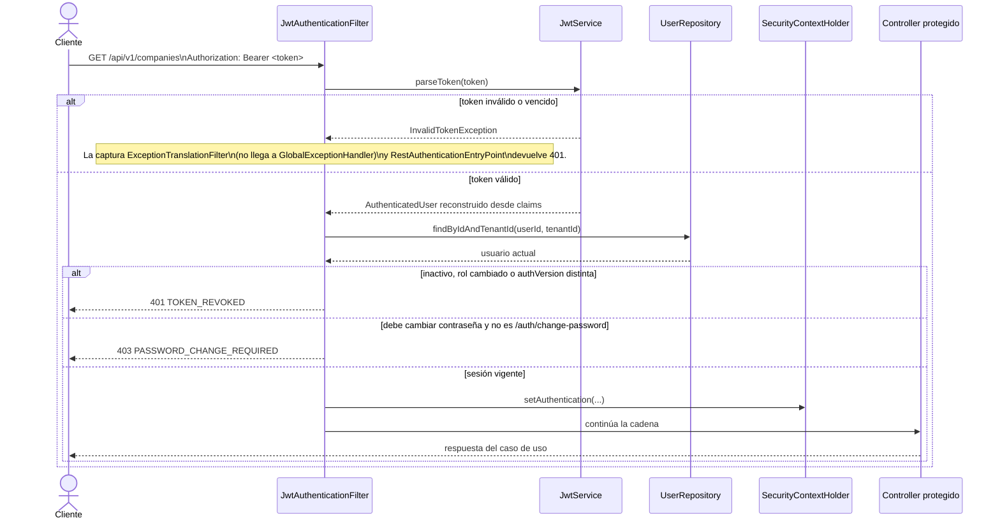

# Secuencia: login (BE-SEC-01)

```mermaid
sequenceDiagram
    actor Cliente
    participant AC as AuthController
    participant AS as AuthService
    participant AM as AuthenticationManager
    participant UDS as CustomUserDetailsService
    participant UR as UserRepository
    participant PE as PasswordEncoder
    participant JS as JwtService
    participant DB as PostgreSQL

    Cliente->>AC: POST /api/v1/auth/login {email, password}
    AC->>AS: login(request)
    AS->>AM: authenticate(UsernamePasswordAuthenticationToken)
    AM->>UDS: loadUserByUsername(email)
    UDS->>UR: findByEmail(email)
    UR->>DB: SELECT ... FROM users WHERE email = ?
    DB-->>UR: fila o vacío
    UR-->>UDS: Optional<User>

    alt usuario no existe
        UDS-->>AM: UsernameNotFoundException
        Note over AM: Spring Security la oculta y la<br/>convierte en BadCredentialsException
    else usuario existe
        UDS-->>AM: AuthenticatedUser (con passwordHash)
        AM->>PE: matches(rawPassword, passwordHash)
        alt password incorrecta
            PE-->>AM: false
            AM-->>AS: BadCredentialsException
        else password correcta
            PE-->>AM: true
            AM-->>AS: Authentication (principal = AuthenticatedUser)
            AS->>JS: generateToken(authenticatedUser)
            JS-->>AS: JWT firmado (HS512, 8h)
            AS->>UR: findById(userId)
            UR-->>AS: User (para firstName/lastName de la respuesta)
            AS-->>AC: LoginResponse
            AC-->>Cliente: 200 OK + accessToken + mustChangePassword + user
        end
    end

    Note over AS,AC: Cualquier rama de error llega a<br/>GlobalExceptionHandler como 401,<br/>con el mismo mensaje (BE-SEC-01/10):<br/>nunca se distingue "no existe" de<br/>"contraseña incorrecta".
```

## Requests posteriores (con JWT)

```mermaid
sequenceDiagram
    actor Cliente
    participant Filter as JwtAuthenticationFilter
    participant JS as JwtService
    participant UR as UserRepository
    participant SCH as SecurityContextHolder
    participant Ctrl as Controller protegido

    Cliente->>Filter: GET /api/v1/companies\nAuthorization: Bearer <token>
    Filter->>JS: parseToken(token)
    alt token inválido o vencido
        JS-->>Filter: InvalidTokenException
        Note over Filter: La captura ExceptionTranslationFilter\n(no llega a GlobalExceptionHandler)\ny RestAuthenticationEntryPoint\ndevuelve 401.
    else token válido
        JS-->>Filter: AuthenticatedUser reconstruido desde claims
        Filter->>UR: findByIdAndTenantId(userId, tenantId)
        UR-->>Filter: usuario actual
        alt inactivo, rol cambiado o authVersion distinta
            Filter-->>Cliente: 401 TOKEN_REVOKED
        else debe cambiar contraseña y no es /auth/change-password
            Filter-->>Cliente: 403 PASSWORD_CHANGE_REQUIRED
        else sesión vigente
            Filter->>SCH: setAuthentication(...)
            Filter->>Ctrl: continúa la cadena
            Ctrl-->>Cliente: respuesta del caso de uso
        end
    end
```
