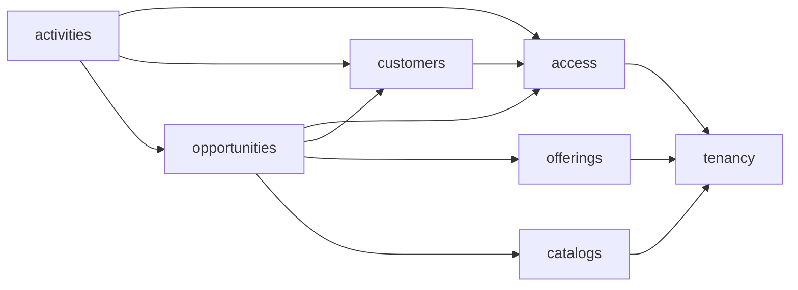

# Módulos y capas

## Límites del backend

El backend se divide por capacidades de negocio:

| Módulo | Responsabilidad | Entidades principales |
|---|---|---|
| `tenancy` | Organizaciones y aislamiento | `Tenant` |
| `access` | Login, usuarios, roles y autorización | `User`, roles |
| `customers` | Empresas, contactos y responsables | `Company`, `Contact` |
| `offerings` | Producto o servicio ofrecido: salones y servicios adicionales | `Venue`, `EventService` |
| `catalogs` | Catálogos configurables | `Stage`, `ActivityType`, `Origin`, `LossReason` |
| `opportunities` | Embudo, asignación, cierres, reserva e historial | `Opportunity`, `StageHistory` |
| `activities` | Interacciones e historial comercial | `Activity` |

`opportunities` coordina referencias a clientes, salones, catálogos y usuarios, pero no debe manipular sus repositorios internos. Cada módulo expone operaciones a los demás **únicamente a través de su paquete `service`** ([ADR-001](../decisiones/adr/ADR-001-estructura-de-paquetes.md)).



Las flechas van del consumidor a la API pública del módulo consumido; no representan acceso directo a implementación. Se deben evitar dependencias circulares.

La visibilidad de clientes derivada de oportunidades aplica inversión de dependencias:
`customers` define `CustomerVisibilityPort` y `opportunities` lo implementa mediante
`OpportunityAccessService`. Así, empresas y contactos pueden consultar si un vendedor
tiene una oportunidad propia relacionada sin acceder a tablas del otro módulo ni crear
una dependencia `customers → opportunities`.

## Capas internas

```text
module/
├── controller/   # entrada HTTP: @RestController
├── service/      # casos de uso, límites transaccionales y contrato hacia otros módulos
├── domain/       # entidades y reglas de negocio (+ enums/)
├── dto/          # request/ y response/ del módulo
├── repository/   # Spring Data JPA (+ specification/)
└── mapper/       # conversión entidad ↔ DTO
```

Reglas de dependencia:

1. `controller` convierte HTTP en llamadas al `service`; no accede a `repository` ni contiene reglas.
2. `service` coordina permisos, reglas, servicios de otros módulos y transacciones.
3. `domain` no depende de Spring MVC, DTOs HTTP ni detalles de persistencia.
4. `repository` sólo persiste; no contiene reglas de negocio.
5. **Sólo `service` es estable para consumidores externos al módulo**; el resto es interno.
   Cuando el módulo de menor nivel necesita una respuesta del superior, define un puerto
   en su propio `service` y el módulo superior aporta la implementación.
6. `shared` se limita a configuración, errores, seguridad, validación y auditoría realmente transversales.

La nomenclatura de capas fue cambiada respecto de la versión original de este documento
(`api/application/domain/infrastructure/web`); el motivo y las alternativas descartadas
están en [ADR-001](../decisiones/adr/ADR-001-estructura-de-paquetes.md).

Un caso de uso se separa en su propia clase de `service` cuando coordina más de una
escritura con una regla de atomicidad real — no todo verbo lo amerita. Así quedó
aplicado: `ChangeStage` es `ChangeStageService` propio, porque escribe `Opportunity` y
`StageHistory` en la misma transacción y no puede modelarse como un `PUT` genérico. En
cambio, crear o editar una oportunidad son métodos de `OpportunityService`: validan
reglas reales (empresa o contacto, salón activo, etapa inicial abierta) pero escriben
una sola entidad, así que no ganan nada con una clase aparte. `ConfirmReservation` y
`LoseOpportunity` (Fase 7/8) se esperan como servicios propios, siguiendo el mismo
criterio que `ChangeStage` — coordinan más de una escritura con reglas de estado.

## Organización del backend

```text
backend/src/main/java/com/ztech/crm/
├── shared/{config,security,exception,validation,audit,dto}/
├── tenancy/        # implementado (Fase 0-1)
├── access/         # implementado (login, cambio de clave y ABM de usuarios)
├── customers/      # implementado (Fase 2)
├── offerings/      # implementado, sólo lectura (Fase 3) — ABM es Fase 6
├── catalogs/       # lectura de Stage y EventType; ABM configurable pendiente
├── opportunities/  # implementado (Fase 3-5, incluido alcance comercial)
└── activities/     # no existe todavía — Fase 7
```

Estado real al cierre de Entrega 1 (24/09), detalle fase por fase en
`docs/specs-backend/tasks.md`.

Las migraciones viven en `backend/src/main/resources/db/migration/` con `V1__initial_schema.sql` como instalación consolidada de esquema y datos semilla. Los cambios posteriores se versionan desde V2.

## Organización del frontend

```text
frontend/src/
├── app/{router,providers,layouts}/
├── features/{auth,users,companies,contacts,offerings,opportunities,activities,settings}/
└── shared/{api,components,hooks,types}/
```

Cada feature contiene páginas, componentes, validaciones, consultas y tipos propios. `shared` solo recibe piezas reutilizadas por varias features. TanStack Query administra estado remoto; el estado de formularios queda en React Hook Form y Zod valida entradas. Las restricciones mostradas en la interfaz mejoran la experiencia, pero nunca reemplazan la validación del backend.

## Pruebas por límite

La intención original era una pirámide de 4 capas separadas para el backend (dominio,
aplicación, infraestructura, web). En la práctica, hasta la Entrega 1, se aplicaron sólo
dos estrategias — ambas contra infraestructura real, ninguna con mocks de repositorio o
`@WebMvcTest` aislado:

- **Unitarios (Mockito, sin Spring ni Testcontainers)**: sólo para servicios con lógica
  de negocio genuina que vale la pena aislar — hoy, `ChangeStageServiceTest`, que prueba
  que una excepción en el insert del historial se propaga sin `catch` (lo que permite
  que `@Transactional` revierta también el cambio de etapa). Corren con `mvn test`
  (Surefire).
- **Integración de punta a punta (`*IT`, Testcontainers)**: un test por flujo relevante,
  entrando por HTTP real (login incluido) y llegando a un PostgreSQL real con las
  migraciones de Flyway aplicadas desde una base vacía. Cubren de una sola vez lo que la
  pirámide original separaba en "aplicación" + "infraestructura" + "web": contratos
  HTTP, validación, códigos de respuesta, tenant-aware queries y transacciones. Corren
  con `mvn verify` (Failsafe), no con `mvn test` — requieren Docker Desktop.
- No hay tests de "dominio" puro (una entidad sin repositorio ni service alrededor):
  las reglas de las entidades son chicas y quedan cubiertas indirectamente por los `*IT`.

El conteo vigente y el detalle de cada corte se mantienen en
`docs/specs-backend/tasks.md`.

- Frontend: comportamiento de features con Vitest y Testing Library.
- E2E: recorridos de entrega con Playwright.
