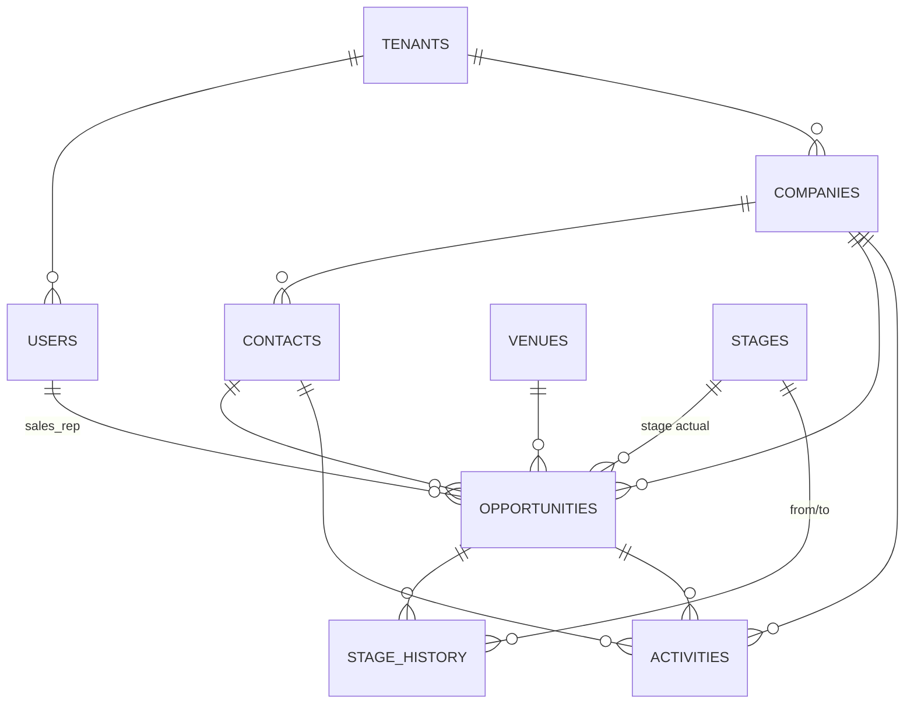

# Backend — Diseño técnico

Cubre los requisitos de `requirements.md` sobre el stack y la estructura fijados en
`AGENTS.md` / `docs/context/`. No repite lo ya acordado ahí; lo referencia.
Es una especificación compartida por Claude, Codex y otros asistentes; `tasks.md`
distingue lo implementado de lo planificado.

## 1. Proyecto base

- Java 25, Spring Boot 4.x, Maven (`backend/pom.xml`), `groupId com.ztech`,
  `artifactId crm-backend`, paquete base `com.ztech.crm`.
- Dependencias iniciales: `spring-boot-starter-web`, `spring-boot-starter-data-jpa`,
  `spring-boot-starter-security`, `spring-boot-starter-validation`,
  `spring-boot-starter-actuator`, `flyway-core`, `flyway-database-postgresql`,
  `postgresql` (driver), `jjwt-api`/`jjwt-impl`/`jjwt-jackson` (o `nimbus-jose-jwt`),
  `springdoc-openapi-starter-webmvc-ui`, `lombok` (opcional, a confirmar en la práctica),
  `testcontainers` + `testcontainers-postgresql` + `testcontainers-junit-jupiter` (test),
  `spring-security-test` (test).
- `backend/Dockerfile`: build multietapa (Maven → JRE 25 slim), expone el puerto que lee
  de `PORT` (Render inyecta esa variable).

## 2. Paquetes (ver ADR-001)

```
com.ztech.crm/
├── CrmApplication.java
├── shared/
│   ├── config/        SecurityConfig, CorsConfig, OpenApiConfig, JacksonConfig, JpaAuditingConfig
│   ├── security/       JwtService, JwtAuthenticationFilter, CustomUserDetailsService,
│   │                    AuthenticatedUser, TenantContext, CurrentUserArgumentResolver
│   ├── exception/      BusinessException, NotFoundException, ConflictException,
│   │                    ForbiddenException, GlobalExceptionHandler
│   ├── validation/     @ValidCuit, @ValidDateRange (custom Bean Validation)
│   ├── audit/          AuditableEntity (MappedSuperclass), TenantOwnedEntity, AuditorAwareImpl
│   └── dto/            PageResponse<T>, ApiError (extiende ProblemDetail)
├── tenancy/            Tenant (entidad + repository, sin controller propio)
├── access/             User, Role (enum), AuthController, UserController, AuthService, UserService
├── customers/           Company, Contact, sus controller/service/repository/dto/mapper
├── offerings/            Venue, EventService, sus controller/service/repository/dto/mapper
├── catalogs/              Stage, ActivityType, Origin, LossReason (CRUD genérico o por catálogo)
├── opportunities/         Opportunity, StageHistory, sus controller/service/repository/dto/mapper
└── activities/            Activity, su controller/service/repository/dto/mapper
```

## 3. Modelo de datos

Todas las tablas de negocio (todo excepto `tenants`) llevan `tenant_id BIGINT NOT NULL
REFERENCES tenants(id)`. Tipos de fecha/hora en `timestamptz`. Moneda: `NUMERIC(15,2)`.

### 3.1 `tenants`
| Columna | Tipo | Notas |
|---|---|---|
| id | bigint identity PK | |
| name | text not null | |
| created_at | timestamptz not null | |

### 3.2 `users`
| Columna | Tipo | Notas |
|---|---|---|
| id | bigint identity PK | |
| tenant_id | bigint not null FK | |
| email | text not null | `UNIQUE (email)` — global, no por tenant (login sin selector de organización) |
| password_hash | text not null | BCrypt |
| first_name / last_name | text not null | |
| role | text not null | `ADMIN` \| `SELLER` \| `SALES_MANAGER` |
| active | boolean not null default true | baja lógica |
| must_change_password | boolean not null default false | limita la sesión al cambio de clave |
| auth_version | bigint not null default 0 | invalida JWT anteriores ante cambios sensibles |
| created_at, created_by, updated_at, updated_by | auditoría | ver `AuditableEntity` |

### 3.3 `companies`
| Columna | Tipo | Notas |
|---|---|---|
| id | bigint identity PK | |
| tenant_id | bigint not null FK | |
| business_name | text not null | nombre comercial; recibe el `name` histórico |
| legal_name | text not null | razón social; recibe el `name` histórico en el backfill |
| cuit | text null | `UNIQUE (tenant_id, cuit)` con índice parcial `WHERE cuit IS NOT NULL` |
| industry | text null | |
| email | text null | formato validado, no único |
| phone | text null | |
| address | text null | |
| locality | text null | |
| website | text null | |
| status | text not null | `POTENCIAL` \| `CLIENTE` \| `INACTIVO` \| `NO_CONTACTAR` |
| sales_rep_id | bigint not null FK → users | responsable comercial obligatorio |
| origin_id | bigint null FK → origins | |
| notes | text null | |
| auditoría | | |

### 3.4 `contacts`
| Columna | Tipo | Notas |
|---|---|---|
| id | bigint identity PK | |
| tenant_id | bigint not null FK | |
| company_id | bigint **null** FK → companies | cliente individual si es null |
| first_name, last_name | text not null | |
| document | text null | `UNIQUE (tenant_id, document)` índice parcial |
| position | text null | cargo |
| email, phone | text null | |
| status | text not null | mismo dominio que `companies.status` |
| sales_rep_id | bigint not null FK → users | hereda el de la empresa o usuario actual |
| origin_id | bigint null FK → origins | |
| notes | text null | |
| auditoría | | |

### 3.5 `venues`
| Columna | Tipo | Notas |
|---|---|---|
| id | bigint identity PK | |
| tenant_id | bigint not null FK | |
| name | text not null | |
| capacity | integer not null | check `capacity > 0` |
| rate | numeric(15,2) null | tarifa |
| address | text null | |
| locality | text null | |
| description | text null | |
| equipment | text[] not null default '{}' | equipamiento incluido |
| status | text not null | `DISPONIBLE` \| `MANTENIMIENTO` \| `INACTIVO` |
| auditoría | | |

### 3.6 `event_services`
| Columna | Tipo | Notas |
|---|---|---|
| id | bigint identity PK | |
| tenant_id | bigint not null FK | |
| name | text not null | |
| description | text null | |
| price | numeric(15,2) null | |
| active | boolean not null default true | |
| auditoría | | |

### 3.7 `stages`
| Columna | Tipo | Notas |
|---|---|---|
| id | bigint identity PK | |
| tenant_id | bigint not null FK | |
| name | text not null | |
| position | integer not null | orden del embudo, `UNIQUE (tenant_id, position)` |
| kind | text not null | `OPEN` \| `WON` \| `LOST` |
| active | boolean not null default true | |

### 3.8 `activity_types`, `origins`, `loss_reasons`, `event_types`
Mismo patrón simple: `id`, `tenant_id`, `name`, `active`. `UNIQUE (tenant_id, name)` en
cada uno.

### 3.9 `opportunities`
| Columna | Tipo | Notas |
|---|---|---|
| id | bigint identity PK | |
| tenant_id | bigint not null FK | |
| title | text not null | |
| company_id | bigint null FK → companies | |
| contact_id | bigint null FK → contacts | check: `company_id IS NOT NULL OR contact_id IS NOT NULL` |
| sales_rep_id | bigint not null FK → users | responsable |
| venue_id | bigint not null FK → venues | un solo salón (DP-09) |
| event_type_id | bigint not null FK → event_types | tipo de evento configurable |
| stage_id | bigint not null FK → stages | etapa actual |
| status | text not null | `ABIERTA` \| `GANADA` \| `PERDIDA` |
| estimated_value | numeric(15,2) null | |
| final_value | numeric(15,2) null | obligatorio si `status = GANADA` |
| probability | integer null | 0–100, opcional |
| event_start / event_end | timestamptz not null | rango `[inicio, fin)`; instantes persistidos en UTC |
| attendee_count | integer not null | check `> 0`; validado contra `venue.capacity` en servicio |
| estimated_close_date | date null | |
| closed_at | timestamptz null | obligatorio si `status <> ABIERTA` |
| origin_id | bigint null FK → origins | |
| loss_reason_id | bigint null FK → loss_reasons | obligatorio si `status = PERDIDA` |
| notes | text null | |
| version | bigint not null default 0 | `@Version` (optimistic locking) |
| auditoría | | |

Restricciones (agregadas en la migración de especialización, POST-E1/EF, ver DP-07):

```sql
ALTER TABLE opportunities ADD CONSTRAINT no_overlapping_won_reservation
  EXCLUDE USING gist (
    tenant_id WITH =,
    venue_id WITH =,
    tstzrange(event_start, event_end, '[)') WITH &&
  ) WHERE (status = 'GANADA');
```
Los extremos contiguos no se superponen. La captura y presentación usa
`America/Argentina/Buenos_Aires`; PostgreSQL conserva los instantes normalizados.

La relación `opportunity_event_services` asocia oportunidades y servicios mediante
sus dos identificadores. No persiste cantidad ni precio histórico (DP-05).

### 3.10 `stage_history`
| Columna | Tipo | Notas |
|---|---|---|
| id | bigint identity PK | |
| tenant_id | bigint not null FK | |
| opportunity_id | bigint not null FK → opportunities | |
| from_stage_id | bigint null FK → stages | null en el primer registro |
| to_stage_id | bigint not null FK → stages | |
| changed_at | timestamptz not null | |
| changed_by | bigint not null FK → users | |
| note | text null | |

**Append-only**: sin `UPDATE`/`DELETE` desde la aplicación; no se expone endpoint de
edición ni borrado. `StageHistoryRepository` no declara `deleteById` ni `save` sobre una
entidad existente (sólo inserts).

### 3.11 `activities`
| Columna | Tipo | Notas |
|---|---|---|
| id | bigint identity PK | |
| tenant_id | bigint not null FK | |
| type_id | bigint not null FK → activity_types | |
| occurred_at | timestamptz not null | fecha del hecho (DP-05 define su relación con `created_at`) |
| company_id | bigint null FK → companies | |
| contact_id | bigint null FK → contacts | |
| opportunity_id | bigint null FK → opportunities | |
| description | text null | |
| result | text null | |
| created_by | bigint not null FK → users | |
| created_at | timestamptz not null | |

Check: al menos uno de `company_id`, `contact_id`, `opportunity_id` no nulo.

### 3.12 Diagrama de relaciones



## 4. Migraciones Flyway

- `V1__initial_schema.sql`: esquema final de 15 tablas, extensión `btree_gist`,
  restricciones e índices, incluida la exclusión GiST de reservas ganadas (DP-07).
- La misma V1 carga tenant, usuarios de demo con contraseña BCrypt y cambio inicial
  obligatorio, 7 etapas, salones, servicios y catálogos, incluidos tipos de evento.
  Conserva el escenario comercial de empresas, contactos, oportunidades, servicios
  asociados, historial de etapas y actividades.
- Consolidación excepcional de V1–V4 autorizada el 17/09/2026 tras reiniciar la base.
  Se instala desde una base vacía, sin el historial Flyway anterior. Se eliminaron los
  pasos de conversión de datos legacy; los cambios posteriores se versionan desde V2.
- Las migraciones aplicadas vuelven a ser inmutables; se validan desde base vacía con
  Testcontainers y en CI (DT-20).

## 5. Capas y flujo de una request

```
HTTP → JwtAuthenticationFilter (resuelve AuthenticatedUser + TenantContext)
     → Controller (valida DTO con Bean Validation, llama a Service)
     → Service (@Transactional, autorización de rol/alcance, orquesta Repository/otros Service)
     → Repository (Spring Data JPA, siempre *AndTenantId)
     → Mapper (Entity ↔ DTO, nunca se devuelve la entidad)
```

Un `service` de un módulo que necesita datos de otro módulo **llama al `service` del
módulo dueño**, no a su repositorio (ADR-001). Ejemplo: `OpportunityService` valida que el
`venueId` exista y esté activo llamando a `VenueService.getActiveOrThrow(id, tenantId)`,
no a `VenueRepository` directamente.

## 6. Seguridad

- **JWT** (HS256, secreto en `JWT_SECRET`): claims `sub` (userId), `tenantId`, `role`,
  `exp`. Expiración ~8h para E1 (DT-11). Sin refresh token en E1.
- `JwtAuthenticationFilter` extrae el token del header `Authorization: Bearer <token>`,
  lo valida, arma un `AuthenticatedUser` (userId, tenantId, role) y lo pone en el
  `SecurityContext` y en `TenantContext` (ThreadLocal o request-scoped bean).
- `SecurityConfig`: todo bajo `/api/v1/**` requiere autenticación salvo
  `/api/v1/auth/login`; `/actuator/health` público; el resto según `@PreAuthorize` por
  rol en cada método de `service` (no sólo en el controller).
- Filtrado por tenant: cada `Repository` de negocio declara sus métodos con
  `AndTenantId`, y cada `Service` obtiene el tenant de `TenantContext`, nunca de un DTO.
- Alcance de `SELLER`: oportunidades por `salesRepId`; clientes por asignación directa
  o por relación con una oportunidad propia. `customers` consulta estas relaciones a
  través de `CustomerVisibilityPort`, implementado por `OpportunityAccessService`, sin
  depender del repositorio ni del dominio de `opportunities`. La escritura de clientes
  exige siempre asignación directa y todo recurso fuera del alcance devuelve `404`.
- `PasswordEncoder`: `BCryptPasswordEncoder` (cost 10).
- CORS: orígenes permitidos desde variable de entorno (`CORS_ALLOWED_ORIGINS`),
  configurado en `CorsConfig`.

## 7. Errores

`GlobalExceptionHandler` (`@RestControllerAdvice`) centraliza el mapeo:

| Excepción | HTTP |
|---|---|
| `MethodArgumentNotValidException` (Bean Validation) | 400, con `errors[]` por campo |
| `NotFoundException` | 404 |
| `ForbiddenException` | 403 |
| `ConflictException` (transición inválida, unicidad, reserva superpuesta) | 409 |
| `BusinessException` genérica (regla de negocio, p. ej. capacidad excedida) | 422 |
| `AuthenticationException` / credenciales inválidas | 401 |
| cualquier otra | 500, sin detalle interno en el body |

Formato de respuesta (extiende `ProblemDetail`, RFC 7807):

```json
{
  "type": "about:blank",
  "title": "Conflicto de disponibilidad",
  "status": 409,
  "detail": "El salón ya está reservado para ese rango de fechas.",
  "code": "VENUE_ALREADY_BOOKED",
  "requestId": "…",
  "errors": []
}
```

## 8. Paginación y filtros

- `PageResponse<T>` propio (`content`, `page`, `size`, `totalElements`, `totalPages`),
  construido desde el `Page<T>` de Spring Data en el `mapper`, no expuesto directo.
- Query params estándar: `page`, `size` (default 20, máx. 100), `sort`.
- Filtros dinámicos con `Specification<T>` en `repository/specification/`, uno por
  módulo que lo necesite (`CompanySpecifications`, `OpportunitySpecifications`).
  Alcance exacto de campos filtrables: DP-10.

## 9. Casos de uso no triviales

### 9.1 Cambio de etapa (`ChangeStageService` dentro de `opportunities`)
1. Cargar `Opportunity` por id + tenant (404 si no existe).
2. Verificar `status = ABIERTA` (409 si está cerrada, salvo reapertura explícita — DP-01).
3. Verificar que la `Stage` destino pertenece al tenant y está `active`.
4. Si `stage.kind = OPEN`: actualizar `stage_id`, insertar `StageHistory`.
5. Si `stage.kind = WON`: exige body con `finalValue`; delega en el caso de uso de "ganar".
6. Si `stage.kind = LOST`: exige `lossReasonId`; delega en el caso de uso de "perder".
7. Todo en una única transacción (`@Transactional`): si falla el insert de historial, se
   revierte el cambio de etapa.

### 9.2 Ganar / perder oportunidad
- `WinOpportunityService`: valida etapa destino `kind = WON`, exige `finalValue` (si el
  negocio usa valores), setea `status = GANADA`, `closedAt = now()`, inserta
  `StageHistory`. Transaccional.
- `LoseOpportunityService`: análogo, exige `lossReasonId`, `status = PERDIDA`.

### 9.3 Reserva concurrente (POST-E1/EF)
- Validación de aplicación: antes de marcar `GANADA`, `OpportunityService` consulta si
  existe otra oportunidad `GANADA` del mismo `venue_id` y tenant cuyo rango se superponga;
  si existe, `409` con mensaje comprensible.
- Restricción física: la exclusión GiST de la sección 3.9 es la última línea de defensa
  ante una carrera entre dos transacciones concurrentes; su violación se captura
  (`DataIntegrityViolationException` → se traduce a `409` en el `GlobalExceptionHandler`).
- Test de Testcontainers: dos hilos confirman la misma reserva a la vez; exactamente uno
  tiene éxito.

## 10. Contrato HTTP (resumen, se detalla en OpenAPI)

```
POST   /api/v1/auth/login
GET    /api/v1/users                      (ADMIN)
POST   /api/v1/users                      (ADMIN)
PUT    /api/v1/users/{id}                 (ADMIN)

GET    /api/v1/companies
POST   /api/v1/companies
GET    /api/v1/companies/{id}
PUT    /api/v1/companies/{id}
GET    /api/v1/companies/{id}/activities

GET    /api/v1/contacts
POST   /api/v1/contacts
GET    /api/v1/contacts/{id}
PUT    /api/v1/contacts/{id}
GET    /api/v1/contacts/{id}/activities

GET    /api/v1/venues
POST   /api/v1/venues                     (ADMIN, EF)
PUT    /api/v1/venues/{id}                (ADMIN, EF)
GET    /api/v1/event-services
POST   /api/v1/event-services              (ADMIN, EF)

GET    /api/v1/stages
POST   /api/v1/stages                     (ADMIN, EF)
GET    /api/v1/activity-types / origins / loss-reasons   (+ POST ADMIN, EF)

GET    /api/v1/opportunities
POST   /api/v1/opportunities
GET    /api/v1/opportunities/{id}
PUT    /api/v1/opportunities/{id}
POST   /api/v1/opportunities/{id}/stage
POST   /api/v1/opportunities/{id}/win
POST   /api/v1/opportunities/{id}/lose
POST   /api/v1/opportunities/{id}/assign
GET    /api/v1/opportunities/board        (agrupado por etapa)
GET    /api/v1/opportunities/{id}/stage-history

POST   /api/v1/activities
GET    /api/v1/opportunities/{id}/activities
```

`springdoc-openapi` genera `/v3/api-docs`; se exporta a `backend/docs/openapi.yaml`
(DT-18, DT-23 — ver sección 12) para que la instancia de frontend lo consuma.

## 12. Documentación y artefactos de entrega

Los artefactos de E1 ya se generaron a pedido del usuario (12/09; ver `tasks.md`).
Se mantienen junto con cada cambio y se completan para la entrega final. Las anotaciones
Swagger se agregan controller por controller. Todo vive en `backend/docs/`, salvo
`backend/README.md`.

```
backend/
├── README.md
├── docker-compose.yml
├── .env.example
├── Dockerfile
└── docs/
    ├── openapi.yaml
    ├── docker.md
    ├── diagrams/
    │   ├── component-diagram.md
    │   ├── sequence-login.md
    │   ├── sequence-change-stage.md
    │   ├── sequence-win-lose-opportunity.md
    │   └── sequence-concurrent-reservation.md
    └── postman/
        ├── zTech-CRM.postman_collection.json
        └── zTech-CRM-Local.postman_environment.json
```

### 12.1 Anotaciones Swagger (springdoc)

Cada `controller` lleva `@Tag(name = "...")` a nivel de clase y `@Operation(summary = ...)`
+ `@ApiResponse` por método (al menos los códigos de la sección 7 que aplican a ese
endpoint). Los DTOs de `request`/`response` documentan sus campos con `@Schema(description
= ...)` cuando el nombre no es autoexplicativo (p. ej. `attendeeCount`, `probability`).

### 12.2 `backend/docs/openapi.yaml`

Export estático generado a partir de `/v3/api-docs.yaml` una vez que el contrato está
estable, mediante `springdoc-openapi-maven-plugin` (goal `generate`, apuntando al
`groupId`/`artifactId` del proyecto) en un profile Maven dedicado, o manualmente con:

```powershell
# Desde backend/, con .env configurado según backend/README.md:
./run.ps1  # en una terminal; carga .env y selecciona el perfil local
# En otra terminal, también desde backend/:
Invoke-WebRequest http://localhost:8080/v3/api-docs.yaml -OutFile docs/openapi.yaml
```

Se regenera cada vez que cambia un endpoint, request o response — no sólo al final.

### 12.3 Diagramas (Mermaid, uno por archivo `.md`)

- **`component-diagram.md`**: los módulos de `com.ztech.crm` (tenancy, access, customers,
  offerings, catalogs, opportunities, activities) y sus dependencias permitidas, más las
  piezas de `shared`. Amplía, con las capas internas de `controller/service/repository`,
  el diagrama de `docs/arquitectura/02-modulos-y-capas.md`.
- **`sequence-login.md`**: cliente → `AuthController` → `AuthService` →
  `CustomUserDetailsService` → `PasswordEncoder` → `JwtService` → respuesta con token.
- **`sequence-change-stage.md`**: cliente → `OpportunityController` → `ChangeStageService`
  → valida etapa/estado → `OpportunityRepository.save` + `StageHistoryRepository.save` en
  una transacción → commit o rollback. Ilustra la regla BE-OPP-05.
- **`sequence-win-lose-opportunity.md`**: análogo para `WinOpportunityService` /
  `LoseOpportunityService` (design §9.2).
- **`sequence-concurrent-reservation.md`**: dos requests simultáneas confirmando el mismo
  salón/rango — una llega a la restricción GiST antes que la otra, la segunda recibe `409`
  (design §9.3). Este diagrama documenta el mecanismo aunque su implementación caiga en la
  fase de especialización.

### 12.4 Colección de Postman

- Una carpeta por módulo (Auth, Companies, Contacts, Venues, EventServices, Stages,
  Catalogs, Opportunities, Activities), con un request por endpoint de la sección 10.
- Variables de colección: `{{baseUrl}}` (default `http://localhost:8080/api/v1`) y
  `{{accessToken}}`.
- El request de login incluye un test script que hace
  `pm.collectionVariables.set("accessToken", pm.response.json().accessToken)`; el resto de
  los requests usan `Bearer {{accessToken}}` en la auth de la carpeta raíz, así no hay que
  copiar el token a mano entre requests.
- `zTech-CRM-Local.postman_environment.json` fija `baseUrl` para correr contra el backend
  levantado en local (o en Docker).

### 12.5 Docker en local

- `backend/Dockerfile`: ya definido (sección 1), build multietapa para la imagen de
  despliegue en Render.
- `backend/docker-compose.yml`: un único servicio (`api`), construye desde el
  `Dockerfile`, mapea `8080:8080` (o `${PORT}`), y toma la configuración de un `.env` local
  (no versionado) basado en `.env.example`. Apunta a Supabase igual que Render — no se
  levanta un Postgres local en compose, porque la base del proyecto es Supabase.
- `backend/docs/docker.md`: cómo construir la imagen, cómo correrla con `docker compose
  up --build`, qué variables de entorno son obligatorias, y una nota de que **los tests de
  integración no dependen de compose**: Testcontainers levanta su propio contenedor de
  PostgreSQL por corrida y sólo necesita Docker Desktop activo.

### 12.6 `backend/README.md`

Estructura mínima:

1. Descripción breve y link a la documentación funcional del repo (`docs/README.md`).
2. Stack y versiones (Java 25, Spring Boot 4.x, PostgreSQL/Supabase, Maven).
3. Requisitos previos: JDK 25, Maven (o el wrapper `./mvnw`), Docker Desktop (para
   Testcontainers y para correr con `docker compose`), una base Supabase accesible.
4. Variables de entorno: tabla con nombre, ejemplo y obligatoriedad, más referencia a
   `.env.example`.
5. Cómo levantar en local sin Docker (`./run.ps1` o `./run.sh`, cargan `.env` y perfil `local`).
6. Cómo levantar en local con Docker (`docker compose up --build`), con link a
   `docs/docker.md`.
7. Cómo correr los tests (`./mvnw test` para unitarios, `./mvnw verify` para incluir
   integración con Testcontainers; requiere Docker corriendo).
8. Documentación de la API: Swagger UI (`/swagger-ui.html`) en local, archivo estático en
   `docs/openapi.yaml`, colección de Postman en `docs/postman/` con sus pasos de import.
9. Diagramas: link a `docs/diagrams/`.
10. Usuario semilla para probar (email y password del `ADMIN` de `V1__initial_schema.sql`),
    aclarando que es sólo para desarrollo/demo, no una credencial de producción.
11. Estructura de paquetes (resumen breve, con link a `docs/context/02-backend-convenciones.md`
    para el detalle).

## 13. Testing (mapea a `02-backend-convenciones.md`)

> **Actualizado 12/09 con lo aplicado de verdad hasta Entrega 1** — el plan original de
> abajo (dominio/service/repository/controller como 4 suites separadas) no es lo que se
> terminó implementando. Se dejan los dos primeros puntos tachados en la intención
> original y se explica qué se hizo en su lugar.

- ~~Dominio: JUnit puro sobre invariantes~~ — no se escribieron unit tests de entidad
  aislada. Las invariantes de dominio son chicas (p. ej. `Opportunity.changeStage`) y
  quedan cubiertas indirectamente por los `*IT`.
- ~~Controller: `@WebMvcTest` + `MockMvc`~~ — no se usó. Se prefirió entrar siempre por
  HTTP real de punta a punta (ver abajo): un `@WebMvcTest` con el service mockeado
  hubiera duplicado casi el mismo caso que ya cubre el `*IT`, sin la garantía extra de
  que el flujo completo funciona contra una base real.
- **Service, con lógica genuina**: JUnit + Mockito, sin Spring ni Testcontainers —
  rápido. Sólo para servicios que coordinan más de una escritura o tienen una regla que
  vale la pena aislar (ver ADR-001/design.md §9: mismo criterio que separar
  `ChangeStageService`). Ejemplo real: `ChangeStageServiceTest`, que prueba que una
  excepción del insert de historial se propaga sin `catch`. Corre con `mvn test`
  (Surefire).
- **De punta a punta (`*IT`)**: un test por flujo relevante, entrando por HTTP real
  (login incluido) contra un PostgreSQL real de Testcontainers, con Flyway aplicado
  desde una base vacía. Cubre de una sola vez contrato HTTP, validación, códigos de
  respuesta, consultas tenant-aware y transacciones — lo que el plan original separaba
  en "repository" + "controller". Corre con `mvn verify` (Failsafe) — requiere Docker
  Desktop, hace falta el plugin `maven-failsafe-plugin` en el `pom.xml` (Surefire no
  recoge `*IT.java` por defecto, es un error real que costó un `clean verify` en
  silencio durante la Fase 2 — ver `docs/specs-backend/tasks.md`).
- Seguridad: cubierta dentro de los `*IT` de cada módulo, no en una suite aparte — al
  menos un test de rol insuficiente (cuando exista `@PreAuthorize`, Fase 6) y uno de
  acceso cruzado de tenant por módulo (pendiente completar para `customers`/
  `opportunities`, ver tasks.md).
